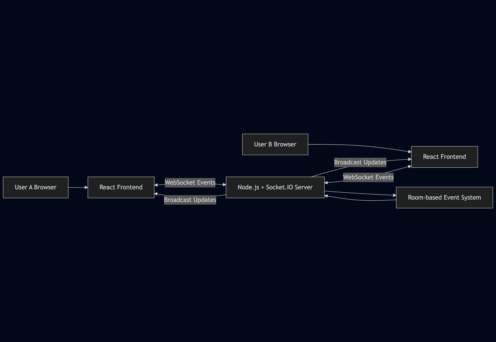

# 👋 Hi, I’m Mayank Verma

Frontend-focused engineer building **scalable, high-performance web applications**, now working across **frontend and backend boundaries**.

Currently working on a **User Data Engine (UDE)** for **real-time user event collection, processing, and access**.  
Previously built a **real-time collaborative code editor** focused on **low-latency updates and shared state consistency**.

I enjoy designing systems where **UI, data flow, performance, and backend architecture** come together.

---

## 🧠 Engineering Focus

- Scalable React architecture & state management
- Real-time and data-heavy systems
- Performance-conscious UI design
- Frontend–backend contract alignment
- Clean, maintainable codebases

---

## 📌 Selected Projects & Architecture

### 🧩 User Data Engine (UDE)

A system for **collecting, processing, and serving high-volume user events** for real-time and analytical use cases.

**Highlights:**
- Event-driven ingestion pipeline
- Redis for fast-access & transient state
- ClickHouse for analytical workloads
- Frontend systems consuming real-time + aggregated data

→ Detailed design, trade-offs, and scaling notes in the project README.

---

### 🧑‍💻 Real-Time Collaborative Code Editor

A multi-user code editor designed to explore **synchronization, performance, and shared state**.

**Highlights:**
- Room-based real-time collaboration
- Event-driven synchronization
- Performance-aware React rendering
- Clear separation of local vs remote state

→ Architecture decisions and challenges explained in the project README.

---

## 💻 Core Tech Stack

**Frontend:** React, Next.js, TypeScript  
**Backend:** Node.js, REST APIs  
**Data:** Redis, ClickHouse  
**Tooling:** Vite, Webpack, GitHub Actions  

---

## 📊 GitHub Activity

---
